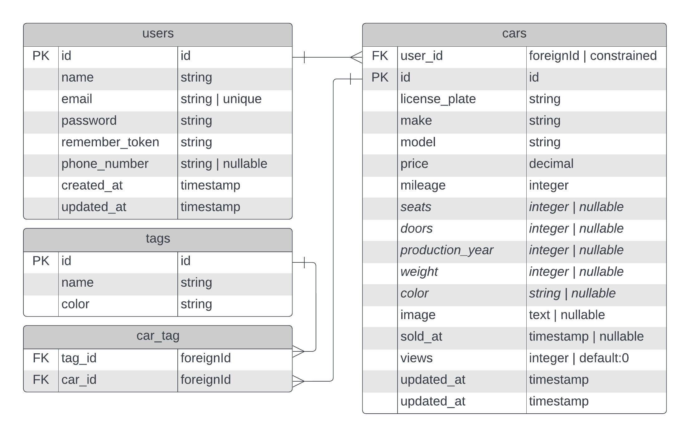

# Installatie
1.	Fork de repo.
2.	Clone jouw kopie van de repository (naar je `C:/laragon/www` map).
3.	Ga naar de map van je repository. Kopieer en hernoem de file `.env.example` naar `.env`.
4.	Open je hele map in Visual Studio Code. Open de `.env`-file.
5.	Controleer de waarden voor DB_DATABASE, DB_USERNAME en DB_PASSWORD. Bij DB_DATABASE vul je in ieder geval de naam in van de database die je net hebt gemaakt.
6.	Open een terminal in VS Code en voer achter elkaar de volgende commando’s uit:
    - `composer install` (hiermee installeert composer alle nodige packages)
    - `php artisan key:generate` (hiermee maak je een encryptie key aan)
    - `php artisan migrate` (hiermee maak je de tabellen aan. Als laravel vraagt of hij de database aan mag maken, kies dan 'yes')
    - `npm install` (hiermee installeer je packages die nodig zijn voor de front-end)
    - `npm run dev` (hiermee gaat npm alle CSS en JavaScript files compileren)
7.	Tenslotte: zorg dat Laragon aan staat, en je apache hebt gereload (als een windows beveiliging melding verschijnt, kies dan 'ja') en ga naar _naamvanmap_.test.

Tip: Krijg je nog steeds een standaard Laragon pagina te zien, druk in Laragon linksonder even op stop, en daarna weer op start. Herlaad dan de pagina.

# ERD
De _schuingedrukte_ velden zijn `nullable` omdat ze later vanuit de RDW API opgehaald kunnen worden.
 

# Brave Browser
Brave blokkeert de functionaliteit van vite die nodig is om de front-end code te laden. Ga in brave naar de adresbalk en vul `brave://settings/shields/filters` in en ga naar de optie "Aangepaste filters maken". Voeg de volgende lijn toe aan het lijstje: `@@||[::1]^$domain=~^.*\.test`. Druk dan onderin op de knop "Wijzigingen opslaan."
